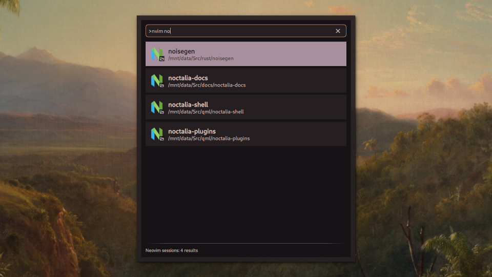

# Neovim Session Provider

A launcher provider plugin that lets you open one of your saved Neovim sessions

## Usage

1. Open the Noctalia launcher
2. Type `>nvim` to enter Neovim mode
3. Add a search term after the command (e.g., `>nvim noct`), or browse the most recently saved sessions
4. Select your session and press Enter

Alternatively, you can trigger the provider by IPC with the command `qs -c noctalia-shell ipc call plugin:nvim-session-provider toggle`.

## Supported session manager plugins

This provider should work with any session manager plugin that stores session
files in a single directory. For session managers that include the git branch name,
the branch is included in parentheses after the session name.

It should work out of the box for the following plugins:
 - `auto-session`
 - `neovim-session-manager`
 - `nvim-possession`

For the following plugins, you will need to change the Sessions directory setting (see below for details):
 - `persistence.nvim` (LazyVim)
 - `persisted.nvim`

## Settings

### Neovim command

The base command used to launch Neovim, including any command line arguments
that you need. Defaults to `nvim`. When using a GUI frontend like `nvim-qt` or
`neovide`, you will need to add a separator so that the Neovim args are parsed
correctly, e.g. `nvim-qt --` or `neovide --`. 

### Run in Terminal

Whether to run Neovim in a terminal when opening sessions. Disable this if you are using a GUI frontend like Neovim-Qt or Neovide. Defaults to `true`.

### Sessions directory

Directory where Neovim session files are saved. Defaults to
`~/.local/share/nvim/sessions`, which is the default path used by the following
session management plugins:
 - `auto-session`
 - `neovim-session-manager`
 - `nvim-possession`

Other session management plugins use `~/.local/state/nvim/sessions` instead, such as:
 - `persistence.nvim` (LazyVim)
 - `persisted.nvim`

Consult the documentation of your session manager plugin if you are using a different one.

## Requirements

- Noctalia 4.5.0 or later
- Neovim (it may work with classic Vim, but I haven't tested it)
- A session management plugin that saves session files in a central location
